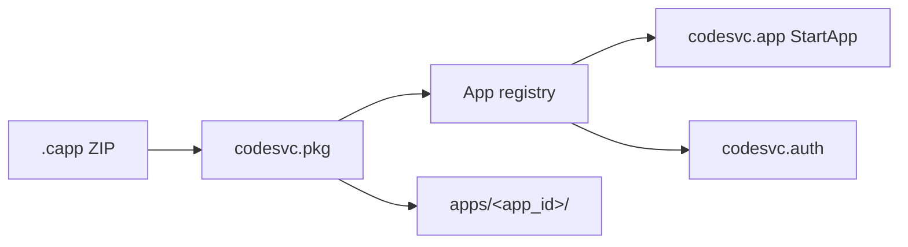
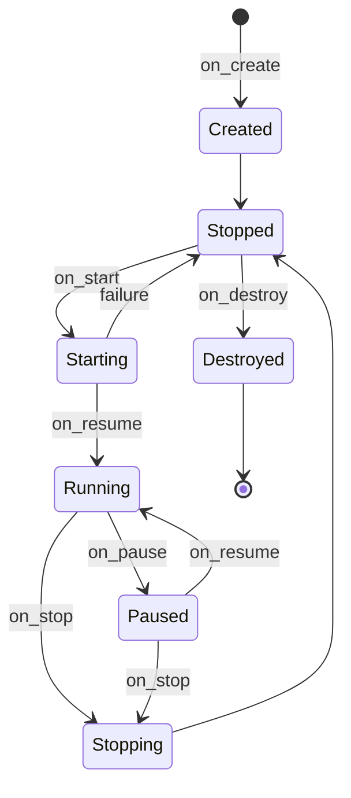

# CodeOS App Model

**Package format:** `.capp` · **Manifest:** `codeos_manifest.toml` · **Version:** 0.1

Authoritative package format by Ronaldo Mijares.

---

## Overview

CodeOS applications are distributed as **`.capp`** files — ZIP archives containing a TOML manifest, binaries, and optional assets. `codesvc.pkg` validates, extracts, and registers packages; `codesvc.app` launches installed apps; `codesvc.auth` enforces declared permissions.





---

## Package Structure

```
MyApp.capp
├─ codeos_manifest.toml      # REQUIRED
├─ bin/myapp                 # REQUIRED (entry.binary)
├─ assets/                   # OPTIONAL
└─ res/                      # OPTIONAL
```

Build with:

```bash
codeos build
```

---

## Manifest Schema

```toml
[app]
id = "com.ronaldo.myapp"
name = "My App"
version = "1.0.0"
min_os_version = "0.1.0"

[entry]
binary = "bin/myapp"
args = []

[ui]
main_view = "res/main_layout.json"
icon = "assets/icon.png"

[permissions]
network = true
storage = true
notifications = true

[metadata]
author = "Ronaldo Mijares"
website = "https://example.com"
description = "Short description of the app."
```

| Field | Required | Description |
|-------|----------|-------------|
| `app.id` | yes | Globally unique reverse-DNS identifier |
| `app.name` | yes | Human-readable app name |
| `app.version` | yes | Semantic version string |
| `app.min_os_version` | yes | Minimum CodeOS version |
| `entry.binary` | yes | Path inside `.capp`; must exist |
| `entry.args` | no | Default launch arguments |
| `ui.main_view` | no | Main layout JSON path (recommended) |
| `ui.icon` | no | Icon asset path (recommended) |
| `permissions.*` | no | Capability flags mapped to `codesvc.auth` |
| `metadata.*` | no | Author, website, description |

JSON schema: `sdk/schemas/manifest.json`

---

## Install Flow

`Pkg.Install` receives `{ capp_path }` and:

1. Validates ZIP archive, manifest, and `entry.binary`
2. Parses manifest and registers `app_id`, name, version, permissions
3. Extracts to `./data/apps/<app_id>/` (or `CODEOS_APPS_DIR`)
4. Grants manifest permissions via `codesvc.auth`
5. Emits `Pkg.AppInstalled`

`Pkg.Uninstall` removes the registry entry, deletes the app directory, revokes permissions, and emits `Pkg.AppUninstalled`.

Production target path: `/var/codeos/apps/<app_id>/`.

---

## Launch Environment

`AppManager.StartApp` looks up the installed app, reads `entry.binary`, and (v0.1 stub) prepares launch with:

| Variable | Value |
|----------|-------|
| `APP_ID` | manifest `app.id` |
| `APP_DATA_DIR` | install directory |
| `MANIFEST_PATH` | `<install>/codeos_manifest.toml` |

---

## CodeApp Trait

Rust apps implement the `CodeApp` trait from `codeos-runtime`:

```rust
pub trait CodeApp {
    fn on_create(&mut self);
    fn on_start(&mut self);
    fn on_resume(&mut self);
    fn on_pause(&mut self);
    fn on_stop(&mut self);
    fn on_destroy(&mut self);
}
```

| Hook | State |
|------|-------|
| `on_create` | Created |
| `on_start` | Starting |
| `on_resume` | Running |
| `on_pause` | Paused |
| `on_stop` | Stopping |
| `on_destroy` | Destroyed |

---

## Permissions

Manifest `[permissions]` booleans map directly to `codesvc.auth` keys:

| Key | Description |
|-----|-------------|
| `network` | Network access |
| `storage` | App storage sandbox |
| `notifications` | Post notifications |

Granted permissions are stored at install time (v0.1 stub).

---

## Related

- [ARCHITECTURE.md](ARCHITECTURE.md)
- [SERVICES.md](SERVICES.md) — `codesvc.app`, `codesvc.pkg`, `codesvc.auth`
- [SDK_OVERVIEW.md](SDK_OVERVIEW.md)
