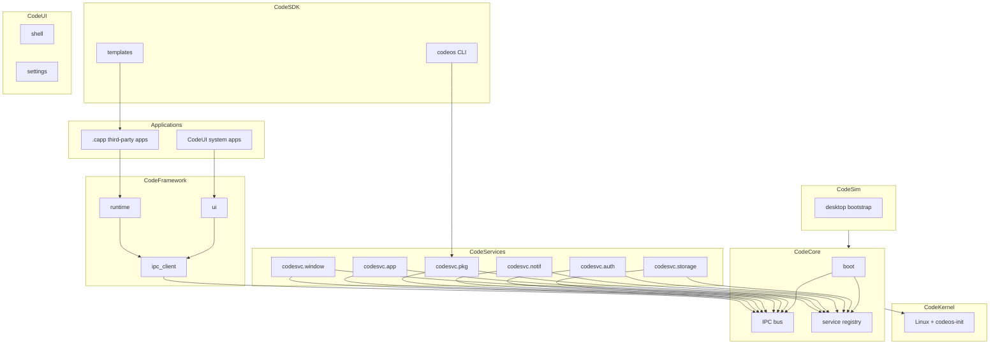
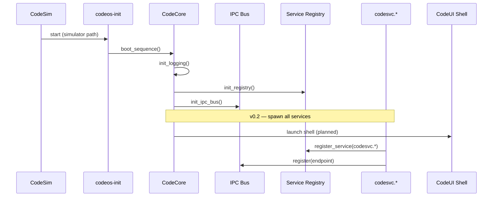

# CodeOS Architecture

**Status:** Authoritative v0.1 · **Author:** Ronaldo Mijares

---

## Executive Summary

CodeOS v0.1 establishes the architectural skeleton of a mobile operating system with an **owned stack** — kernel boundary, core, services, framework, UI, SDK, and simulator. Development is **simulator-first** on desktop; hardware porting follows through QEMU ARM to real devices.

---

## Layer Model

| Layer | Component | Responsibility |
|-------|-----------|----------------|
| 1 | **CodeKernel** | Linux boundary, `codeos-init`; no kernel mods in v0.1 |
| 2 | **CodeCore** | Boot, IPC bus, service registry, process tracking |
| 3 | **CodeServices** | Modular daemons (`codesvc.*`) |
| 4 | **CodeFramework** | Runtime, UI, IPC client stubs |
| 5 | **CodeUI** | Shell, settings, system chrome |
| 6 | **CodeSDK** | CLI, templates, documentation |
| 7 | **CodeSim** | Desktop simulator bootstrap |



---

## Boot Flow



Entry point in CodeCore:

```rust
pub fn init_core() {
    logging::init_logging();
    services::registry::init_registry();
    ipc::bus::init_ipc_bus();
    // TODO: spawn system services and launch System UI.
}
```

---

## Design Principles

1. **Message-based IPC only** — no shared memory between processes in v0.1
2. **Explicit service names** — all system daemons use `codesvc.*` endpoints
3. **Manifest-driven apps** — `codeos_manifest.toml` inside `.capp` archives
4. **Monorepo coherence** — single Cargo workspace for Rust components
5. **Simulator-first** — validate full stack on desktop before ARM hardware

---

## Crate Map

| Path | Crate | Role |
|------|-------|------|
| `core/` | `codecore` | Boot, IPC, registry |
| `services/window/` | `codesvc-window` | Window management |
| `services/appmgr/` | `codesvc-appmgr` | App lifecycle |
| `services/pkg/` | `codesvc-pkg` | Package install |
| `services/notif/` | `codesvc-notif` | Notifications |
| `services/auth/` | `codesvc-auth` | Auth tokens |
| `services/storage/` | `codesvc-storage` | App storage |
| `framework/runtime/` | `codeos-runtime` | `CodeApp` trait |
| `framework/ui/` | `codeos-ui` | Scene graph |
| `framework/ipc_client/` | `codeos-ipc-client` | IPC stubs |
| `system_ui/shell/` | `codeos-shell` | Home / status bar |
| `system_ui/settings/` | `codeos-settings-ui` | Settings |
| `sdk/cli/` | `codeos-cli` | Developer CLI |
| `simulator/desktop/` | `codesim-desktop` | Simulator |

---

## Related Documents

- [APP_MODEL.md](APP_MODEL.md)
- [IPC_DESIGN.md](IPC_DESIGN.md)
- [SERVICES.md](SERVICES.md)
- [UI_FRAMEWORK.md](UI_FRAMEWORK.md)
- [SDK_OVERVIEW.md](SDK_OVERVIEW.md)
- [ROADMAP.md](ROADMAP.md)
