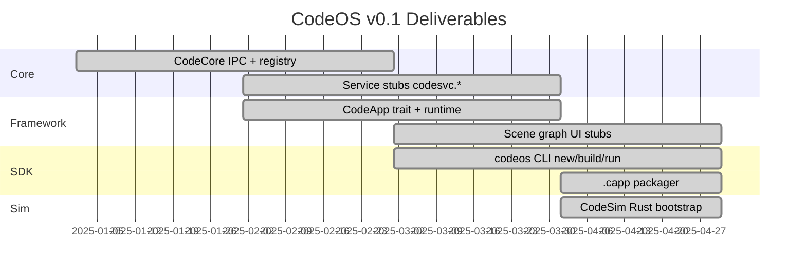

# CodeOS Roadmap

**Author:** Ronaldo Mijares · **Current:** v0.1 (simulator-first alpha)

---

## v0.1 — Foundation (current)

### In scope

- [x] Monorepo aligned to authoritative architecture
- [x] CodeCore boot, IPC bus, service registry
- [x] Six `codesvc.*` service stubs with IPC handlers
- [x] `.capp` format and `codeos_manifest.toml`
- [x] `CodeApp` lifecycle trait and state machine
- [x] CodeFramework runtime, UI, IPC client
- [x] CodeUI shell and settings stubs
- [x] `codeos` CLI (`new`, `build`, `run`, `docs`)
- [x] CodeSim desktop bootstrap
- [x] Integration tests (IPC, lifecycle, registry)
- [x] Architecture documentation

### Deferred to v0.2

- [ ] Multi-process IPC transport (Unix sockets)
- [ ] CodeSim native UI bridge (replace Electron prototype)
- [ ] `codeos-init` and Linux userspace boot
- [ ] Kernel build pipeline
- [ ] Full capability enforcement via `codesvc.auth`
- [ ] Compositor integration for `codesvc.window`
- [ ] Notification shade and app switcher UI
- [ ] OTA, app store, telephony

---

## v0.2 — Simulator Complete

- Orchestrated service spawn from CodeSim
- Render pipeline connecting `codeos-ui` to simulator display
- End-to-end app install → launch → lifecycle in simulator
- QEMU ARM bring-up with `codeos-arm64-defconfig`
- CI pipeline (build, test, clippy)

---

## v0.3 — Device Alpha

- Real hardware reference board
- Power management, display, input drivers
- Production-hardened sandbox
- Permission UX

---

## v1.0 — Production Target

- App store ecosystem
- OTA updates
- Full security audit
- Developer documentation site

---

## Related

- [ARCHITECTURE.md](ARCHITECTURE.md)
- [kernel/linux-notes.md](../kernel/linux-notes.md)
