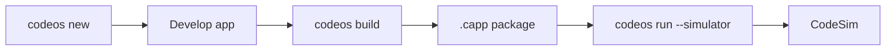

# CodeOS SDK Overview

**CLI binary:** `codeos` · **Crate:** `codeos-cli`

---

## Commands

```bash
codeos new <name> [--template rust-app]
codeos build [--path .]
codeos run [--simulator] [--path .]
codeos docs
```

| Command | Description |
|---------|-------------|
| `new` | Scaffold app from template with `codeos_manifest.toml` |
| `build` | Produce `.capp` ZIP archive |
| `run` | Launch on device or CodeSim |
| `docs` | Print documentation index |

---

## Workflow



---

## Templates

Located in `sdk/templates/`:

| Template | Description |
|----------|-------------|
| `rust-app` | Minimal Rust app with TOML manifest |

Create custom templates by copying the directory structure:

```
my-template/
├── codeos_manifest.toml
└── src/main.rs
```

---

## Building from Source

```bash
cargo build -p codeos-cli
cargo run -p codeos-cli -- new hello
```

Installed binary name: **`codeos`**

---

## Package Format

See [APP_MODEL.md](APP_MODEL.md). The CLI delegates packing to `codesvc-pkg` library (`CappPackager`).

---

## Documentation

| Path | Topic |
|------|-------|
| `sdk/docs/README.md` | SDK index |
| `docs/APP_MODEL.md` | Manifest schema |
| `docs/ARCHITECTURE.md` | Layer model |

---

## Migration from Legacy CLI

| Old command | New command |
|-------------|-------------|
| `codeos init` | `codeos new` |
| `codeos install --simulator` | `codeos run --simulator` |
| `codeos launch` | `codeos run` |
| `codeos pulse-tap` | removed (use tracing / v0.2 debug tools) |
| `.cpk` output | `.capp` output |

---

## Related

- [APP_MODEL.md](APP_MODEL.md)
- [ROADMAP.md](ROADMAP.md)
