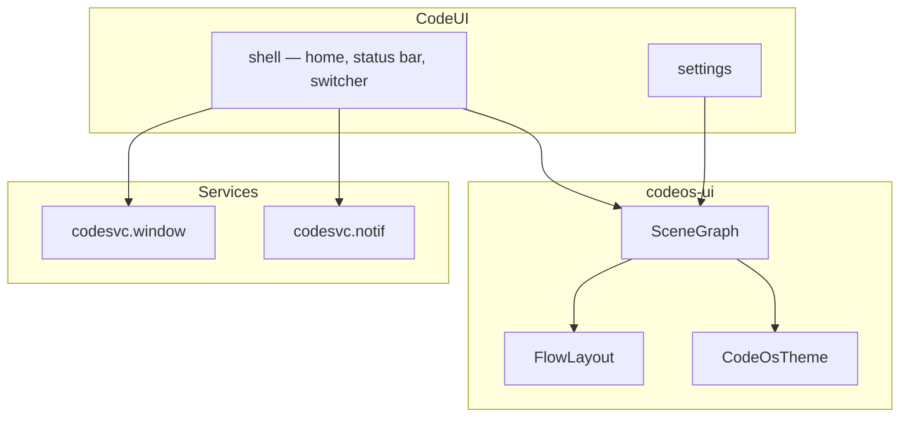

# CodeOS UI Framework

**Crate:** `codeos-ui` · **System UI:** `codeos-shell`, `codeos-settings-ui`

---

## Overview

CodeFramework UI provides a declarative **scene graph**, layout engine, and theme tokens for both system shell and third-party applications. CodeUI builds the system chrome on top: home screen, status bar, notification shade, app switcher, and settings.



---

## Scene Graph

```rust
use codeos_ui::{SceneGraphBuilder, CodeOsTheme};

let theme = CodeOsTheme::dark();
let (builder, _) = SceneGraphBuilder::new().text("Welcome to CodeOS");
let scene = builder.build();
```

### Node Types

| `NodeKind` | Purpose |
|------------|---------|
| `Column` / `Row` | Layout containers |
| `Text` | Text content |
| `Image` | Bitmap / vector source |
| `Spacer` | Flexible gap |
| `Surface` | Compositor surface |

---

## Layout

`FlowLayout::measure` provides v0.1 stub sizing. Full constraint solver lands in v0.2.

```rust
use codeos_ui::{FlowLayout, LayoutConstraints};

let (w, h) = FlowLayout::measure(3, LayoutConstraints {
    max_width: 1080,
    max_height: 2400,
});
```

---

## Theming

| Token | Dark | Light |
|-------|------|-------|
| `primary` | `#0066FF` | `#0052CC` |
| `background` | `#0A0A0F` | `#F5F5FA` |
| `surface` | `#16161E` | `#FFFFFF` |
| `on_surface` | `#F0F0F5` | `#1A1A24` |

---

## System Shell Components

| Component | Crate module | Status |
|-----------|--------------|--------|
| Home | `system_ui/shell/home.rs` | Stub scene |
| Status bar | `system_ui/shell/status_bar.rs` | Theme hook |
| App switcher | planned | v0.2 |
| Notification shade | via `codesvc.notif` | v0.2 |
| Settings | `system_ui/settings/` | Stub |

---

## Compositor → Simulator Pipeline (v0.1)

Apps submit frames via `Window.SubmitFrame` (IPC event). `codesvc.window` validates the surface and forwards pixel data to a `FrameSink`:

```text
App (SubmitFrame) → codesvc.window → FrameSink → CodeSim SimulatorRenderer → DeviceWindow (1080×1920)
```

| Layer | Crate / module | Role |
|-------|----------------|------|
| Compositor service | `codesvc-window` | Surface lifecycle, frame validation, `Window.SurfaceChanged` |
| Frame hook | `codesvc-window::renderer_hook` | `FrameSink`, `LogFrameSink`, `set_frame_sink` |
| Simulator host | `codesim-desktop` | Registers services, installs sink at boot |
| Renderer stub | `simulator/desktop/src/renderer.rs` | `present_frame` / `render_device_screen` |
| Device screen | `simulator/desktop/src/window.rs` | `DeviceWindow` dimensions |

v0.2 will decode base64 buffers and blit into a real window; future transports include shared memory and FD passing.

---

## Migration from Legacy

| Old | New |
|-----|-----|
| FrameKit | `codeos-ui` |
| `apps/launcher` | `codeos-shell` |
| `apps/settings` | `codeos-settings-ui` |

---

## Related

- [ARCHITECTURE.md](ARCHITECTURE.md)
- [SERVICES.md](SERVICES.md)
