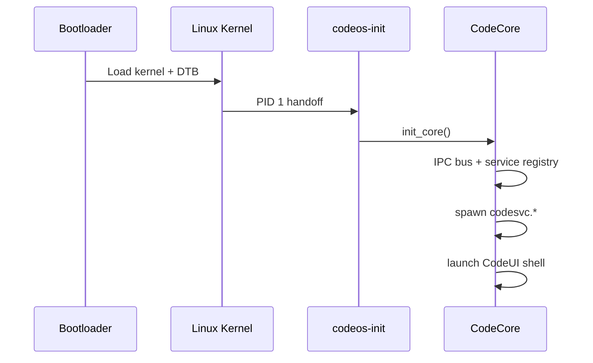

# CodeOS Linux Kernel Notes (CodeKernel)

CodeKernel is the Linux boundary for CodeOS. v0.1 does **not** modify the kernel; we ship configuration stubs and document the boot path for v0.2.

## Boot chain (target)

## Layout

| Path | Purpose |
|------|---------|
| `kernel/configs/` | defconfigs for simulator and ARM64 |
| `kernel/dts/` | device tree sources |
| `kernel/patches/` | CodeOS-specific patches (v0.2+) |

## Targets

| Config | Target |
|--------|--------|
| `codeos-simulator-defconfig` | Development / CI (minimal) |
| `codeos-arm64-defconfig` | QEMU `virt` and reference ARM64 boards |

## v0.1 status

Configuration stubs only. Full kernel build pipeline and `codeos-init` land in v0.2.

See also [README.md](README.md).
